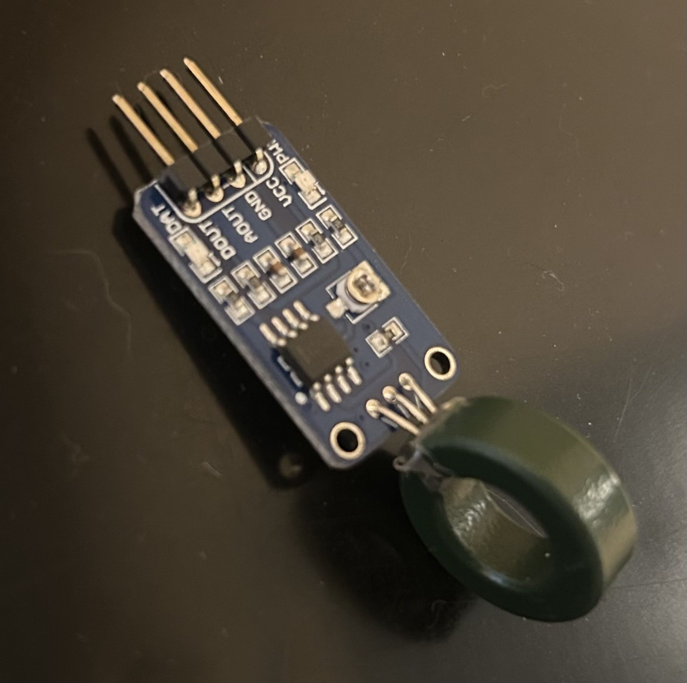

Nathan Story Mizzou Ag3225 Sensors
---

### What it is
I built this to measure how many amps are running through a wire without having to cut into it. It uses a ferrite donut with a slot cut out for an LM393 linear Hall Effect sensor. The donut sits around the wire to pick up the magnetic field, and the sensor sends that data to an Arduino.

### How it works
* **The Sensor:** It uses an LM393 linear Hall sensor module.
* **The Setup:** The sensor connects to the **A0** pin on the Arduino. It also has a small OLED screen (SSD1306) to show the readings in real-time.
* **Zeroing it out:** With no current flowing, the sensor idles at an analog value of **527**.
* **Reading Direction:** Anything above 528 is positive current, and anything below 527 is negative current.

### The Math
To get from a raw number to actual Amps, I ran some tests and interpolated to get a formula I figured out in Excel.

**The Formula:**

$$Amps = \frac{|AnalogValue - 527| - 0.7278}{3.0409}$$

It also calculates the voltage at the sensor pin based on a **4.61V** reference.

### Screen Output
The OLED shows three things:
1. **Analog:** The raw 0–1023 number from the sensor.
2. **Amps:** The actual current calculation.
3. **Volts:** The voltage reading at the Hall sensor.

---

Note: This project took place in 2020. Ai was used to help me resummarize the project. The original repo can be found here: 

https://github.com/NateS-Ag3225/sensors_project_current_transducer

